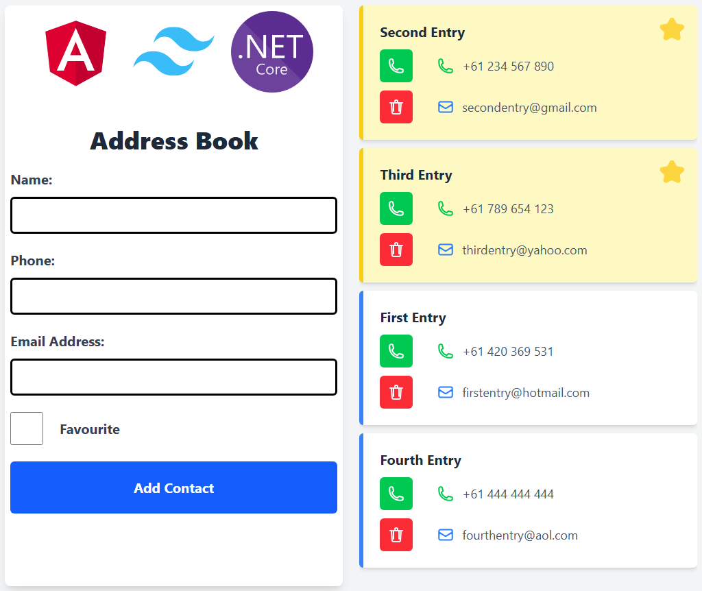

# Address Book WebApp

The Address Book WebApp is a simple and efficient web application that allows users to store, manage, and search for contact information. Built using modern web technologies, this project provides an intuitive interface for adding, editing, and deleting contacts while ensuring data persistence and easy access.





## Getting Started

These instructions will guide you through setting up the project on your local machine for development and testing. See the deployment section for notes on how to deploy the project on a live system.

### Prerequisites

- **Web Browser**: A modern web browser (Google Chrome, Mozilla Firefox, etc.) is required to use the Address Book WebApp.
- **.NET Core SDK**: Required to run the backend server.
- **Node.js & npm** (Optional): Required if you want to run a local frontend server or extend functionalities.

### Installing

1. Clone the repository:
   ```bash
   git clone https://github.com/KKDN7355/Address-Book.git
   cd Address-Book
   ```

2. Open `index.html` in your browser:
   ```bash
   open index.html  # For macOS
   start index.html  # For Windows
   ```
   Or use a local server:
   ```bash
   npx http-server
   ```

3. Start the .NET Core backend server:
   ```bash
   cd backend
   dotnet run
   ```

The application should now be running in your browser with the backend server.

## Using the Address Book

1. **Adding Contacts**: Enter contact details (name, phone, email, etc.) and click the "Add Contact" button.
2. **Editing Contacts**: Select a contact, modify the details, and save changes.
3. **Deleting Contacts**: Click the delete button next to a contact to remove it.
4. **Searching Contacts**: Use the search bar to find contacts quickly.

## Features

- **Add, Edit, and Delete Contacts**: Manage contact entries efficiently.
- **Search Functionality**: Quickly find contacts based on name or other details.
- **Data Persistence**: Stores contact information using .NET Core backend and database.
- **Responsive Design**: Optimized for both desktop and mobile users.
- **User-Friendly Interface**: Simple and intuitive layout for seamless navigation.

## Built With

* **HTML5 & CSS3** - For the front-end structure and styling.
* **AngularJS** - For dynamic interactions and logic.
* **.NET Core** - For backend API and database management.

## Deployment

To deploy the Address Book WebApp, you can:

1. **Use GitHub Pages for Frontend**:
   - Go to your repository settings on GitHub.
   - Enable GitHub Pages under the "Pages" section.
   - The web app will be accessible at `https://your-username.github.io/Address-Book/`.

2. **Deploy on a Web Server**:
   - Upload the project files to a web server.
   - Ensure the .NET Core backend is hosted on a server and properly configured.

## License

This project is licensed under the MIT License - see the [LICENSE.md](LICENSE.md) file for details.

## Acknowledgments

* Inspired by the need for a simple and effective contact management system.
* Thanks to online resources and contributors for guidance and improvements.
* Special appreciation for feedback and feature suggestions from users.

